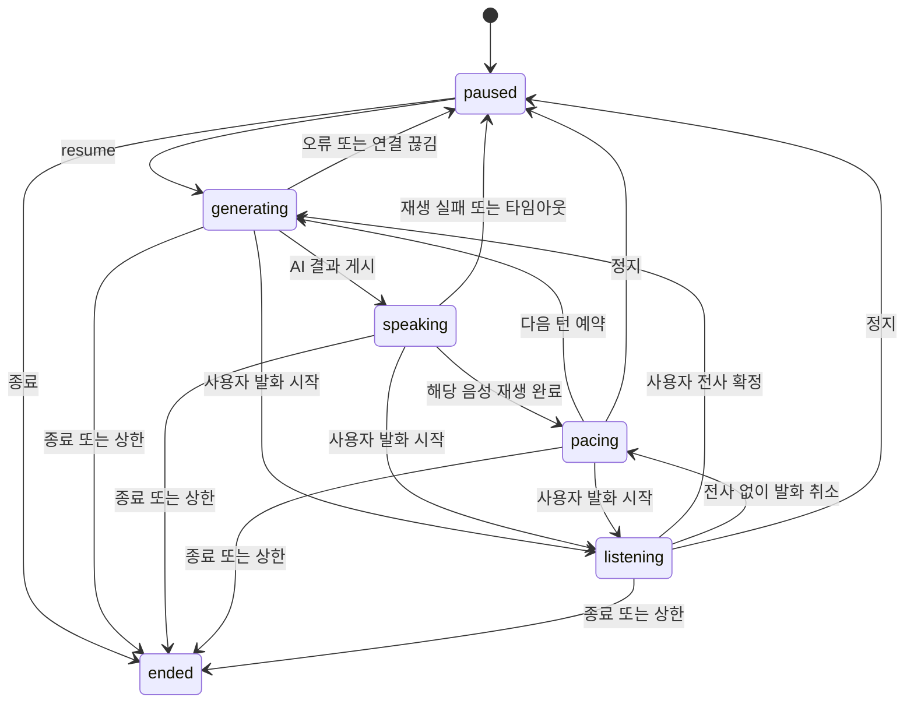

# 음성 대화 설계

버전 0.3 · 2026-10-01

## 기본 화면과 개발 화면

`/`는 단일 버튼 음성 화면이다. 시작 요청에서 서버가 주제를 자동으로 정하고 고정 Persona A/B를 사용한다. 기본 언어는 서버의 `TIKITAKA_LANGUAGE`로 정한다. 기본값 `ko`는 내부 검증용이며 영어 MVP에서는 `en`을 사용한다. 사용자에게 사전 설정을 요구하지 않는다.

`/lab`은 개발자용 언어·주제 선택, 메시지 기록, 텍스트 진단과 제어 이벤트 화면이다. 두 화면은 동일한 음성 어댑터와 API를 사용하지만 세션 캐시는 분리한다. 화면을 단순화해도 취소, 재전송, 연결 끊김과 마이크 자원 반환은 유지한다. 준비 중 단일 버튼으로 취소하면 진행 중 요청과 음성 시작을 무효화하며 늦게 도착한 결과로 자동 시작하지 않는다.

`/mic`은 AI·STT 없이 입력 레벨과 장치 이름을 확인하는 PC 점검 화면이다. 사용자가 선택한 장치 ID는 해당 브라우저의 로컬 저장소에만 저장하고 대화 캡처에도 적용한다. 일반 시작 화면에는 마이크 선택기를 넣지 않는다. Android는 기본 입력과 이어폰·Bluetooth 경로를 자동 관리하는 별도 어댑터를 구현한다.

## 모듈과 책임

```text
PC 음성 테스트 클라이언트 / 이후 Android 클라이언트
  마이크 · 발화 감지 · 전사 · 음성 재생 · 즉시 재생 취소
              ↕ WebSocket 제어 이벤트
Backend API
  Conversation Engine
    상태와 revision · 화자 선택 · 예약 · 취소 · 예산
         ├─ Persona와 Topic 데이터
         ├─ LLM Gateway → Demo / 실제 Provider
         └─ Session Repository → 로컬 SQLite
```

초기 서버는 FastAPI 단일 프로세스다. SQLite로 추가 DB 설치 없이 확정 기록을 저장한다. 저장소 경계를 유지해 다중 사용자 출시 단계에서 PostgreSQL로 바꿀 수 있다. PC 화면은 HTML·CSS·JavaScript로 만들고 별도 프런트엔드 빌드 도구를 요구하지 않는다.

PC 브라우저의 SpeechRecognition과 speechSynthesis는 개발 어댑터다. 지원 여부, 네트워크, 설치된 음성에 영향을 받는다. 실제 Android 음성 캡처, 에코 제거, STT/TTS 어댑터와 동일한 품질을 보장하지 않는다. Android에는 같은 대화 제어 이벤트 계약을 적용한다.

## 세션 상태



## 발언권과 취소

1. 브라우저는 사용자 발화 시작 시 서버 왕복을 기다리지 않고 현재 음성을 취소한다.
2. 서버는 revision을 증가시키고 현재 생성, 재생 대기, 다음 턴 타이머를 취소한다.
3. 생성 작업이 취소를 무시하고 응답해도 시작 revision이 다르면 결과를 버린다.
4. 중단된 AI 발화는 `interrupted`로 표시한다. 전체 발화를 사용자가 들은 것으로 취급하지 않는다.
5. 사용자 전사를 저장하면 새로운 revision에서 응답을 생성한다. A/B 둘의 응답을 동시에 생성하지 않는다.
6. 다음 AI 턴은 클라이언트의 실제 `playback_finished`를 기다린다. 서버 생성 완료를 음성 종료로 착각하지 않는다.

Gateway 동시 실행은 세션별 1개로 제한한다. 취소가 Provider 내부 처리와 과금을 되돌린다는 보장은 없다. 요청 횟수·사용량을 별도로 기록한다.

## 메시지와 이벤트 계약

메시지는 `id`, `seq`, `speaker`, `text`, `revision`, `delivery`, `created_at`을 가진다. delivery는 사용자 메시지 `received`, AI 메시지 `pending`, `played`, `interrupted` 중 하나다. 서버가 확정한 seq가 순서 기준이다.

| 클라이언트 이벤트 | 의미 |
|---|---|
| `resume` / `pause` / `end` | 세션 제어 |
| `speech_started` | 사용자 발화 시작과 재생 중단 |
| `speech_activity` | 발화가 계속될 때 전사 대기 타임아웃 갱신 |
| `user_message` | 확정 전사와 `client_message_id` |
| `speech_cancelled` | 음성은 감지됐지만 확정 전사 없음 |
| `playback_finished` | `message_id`, `revision`에 해당하는 음성 재생 완료 |
| `playback_failed` | 음성 출력 실패. 자동 다음 턴 금지 |
| `heartbeat` | 연결 활성 확인 |

| 서버 이벤트 | 의미 |
|---|---|
| `snapshot` | 상태와 기록 복원 |
| `state` | 현재 상태, revision, 다음 화자 |
| `message` | 사용자 또는 AI 확정 메시지 |
| `delivery` | 중단·재생 완료 상태 변경 |
| `interrupt` | 재생 취소 신호 |
| `error` | 공개 가능한 오류 코드와 안내 |

AI 재생 완료는 해당 메시지와 revision이 일치할 때만 처리한다. 재연결로 교체된 이전 소켓은 더 이상 명령을 실행할 수 없다. 마지막 연결 종료와 heartbeat 만료는 정지로 처리한다. 서버 재시작 후에도 세션은 정지로 복원한다.

## Persona와 Gateway

Persona는 id, 이름, 역할, 성격 제어값, 말투, 관심사, 관계 설정을 가진 버전 데이터다. 모델 이름은 Persona에 넣지 않는다. 주제 데이터에는 두 AI의 서로 다른 입장과 후속 관점을 넣는다.

Gateway 입력은 해당 Persona, Topic, 언어, 최근 확정 기록, 목적, 마지막 사용자 발화다. Gateway 반환은 발화 한 개와 선택적 사용량이다. 데모 Gateway는 결정적 대본을 반환하며 실제 대화 모델로 표시하지 않는다. 실제 Provider는 환경변수로 명시적으로 선택하고 키는 서버에만 둔다.

## 음성 어댑터

2026-10-06 실제 GPT 연결 준비: 기존 Responses 어댑터로 먼저 공유 대화 맥락과 사용자 요청 반영을 실검증한다. 초기 주제는 대화를 여는 용도로만 사용하고, 사용자가 새 주제를 꺼내거나 그냥 들어달라고 요청하면 그 흐름을 따른다. 캐릭터 차이는 매 발화마다 반대하도록 강제하는 규칙이 아니다. 비표시 키 입력 도구 `start-openai.ps1`과 최대 3회 실제 호출 검사 `check_openai.py`를 사용한다. API 키가 없어 현재 실제 GPT 품질은 미검증이다.

음성 자연스러움은 Realtime 음성 입력·출력과 발화 감지를 적용하는 다음 단계에서 개선한다. 두 AI의 공유 기록과 발언권 제어는 유지하고, 사용자가 들은 지점에서 재생을 중단하며 중단된 뒷부분을 맥락에 포함하지 않는 처리가 필요하다. 현재 브라우저 STT/TTS는 이 실시간 경로와 구분한다. 공식 [Realtime 시작 안내](https://developers.openai.com/api/docs/guides/realtime)와 [끼어들기·재생 기록 처리](https://developers.openai.com/api/docs/guides/realtime-conversations)를 근거로 하며, 해당 경로의 코드 구현과 실검증은 아직 하지 않았다.

- SpeechRecognition의 중간 전사는 입력 도중 화면에 표시한다. 서버에는 브라우저의 최종 전사 또는 앱이 발화 종료 시 채택한 전사를 한 번 전송한다.
- 중간 전사만 남으면 발화 종료 후 1.2초, 또는 전사가 2.5초 동안 변하지 않을 때 `recognition.stop()`으로 최종 결과를 요청한다. 최종 결과를 받은 뒤 1.2초 발화 모으기를 거쳐 한 번 전송하고 인식을 재시작한다. 최종 결과 없이 인식이 종료되면 마지막 인식 문장을 앱의 발화 종료 결과로 채택한다. 브라우저의 `isFinal`을 바꾸지 않으며 이 경로는 인식기의 최종 전사보다 정확도가 낮을 수 있다. 종료 시 입력 감도를 다시 보정해 지속된 잔여 입력이 전송을 막지 않게 한다. 확정 요청이 4.5초 동안 종료되지 않으면 안내 후 정지한다.
- 재생 시작·종료·오류를 서버에 알린다. 취소 시 이전 재생 콜백을 토큰으로 무효화한다.
- PC에서는 getUserMedia 입력의 에너지 활동이 120ms 지속되면 음성을 로컬에서 취소한다. SpeechRecognition의 `speechstart`와 새 중간 전사도 보조 신호로 사용한다. 에너지 감지는 말소리와 소음을 의미적으로 구분하지 못한다.
- 마이크 Source·Analyser·0 Gain 노드를 명시적으로 유지하고 무음 출력 경로까지 연결한다. 입력 감지는 화면 렌더링과 별개로 20ms 간격으로 읽는다. 마이크 소리가 스피커로 재생되지 않도록 출력 Gain은 0이다.
- 시작 후 200ms 동안 주변 입력을 자동 보정하고 최근 2초의 낮은 입력 구간을 기준으로 감도를 조정한다. 최소 RMS 기준은 0.006으로, 기존 고정 0.035보다 작은 입력도 감지한다. 음성이나 소음의 의미를 구분하는 VAD는 아니다.
- `SpeechRecognition.start(audioTrack)`에 getUserMedia의 같은 트랙을 전달한다. 지원하는 Chrome에서는 STT와 활동 감지가 같은 입력을 사용한다. 미지원 엔진은 인자를 무시하거나 기존 마이크 경로로 대체할 수 있으므로 모든 브라우저에서 같은 캡처를 보장하지 않는다.
- 스피커 에코, 소음, 짧은 머뭇거림은 Android 실제 오디오 경로에서 다시 검증한다. 초기 PC 음성 검증은 이어폰 사용을 권장한다.

## 로컬 운영 범위

개발 서버는 기본 `127.0.0.1`에만 바인딩한다. 세션별 비밀 토큰으로 HTTP와 WebSocket을 보호한다. 토큰은 URL에 넣지 않고 소켓 첫 인증 이벤트로 전송한다. 공개 배포용 로그인·HTTPS·보관 정책·다중 서버 조정은 출시 단계에서 구현한다. 개발 기록은 `.runtime/`에 저장하고 Git에 넣지 않는다.

마이크 문제 진단은 세션 토큰으로 보호한 `/audio-diagnostics` POST로 저장한다. 기기 이름, 최대 입력 레벨, 트랙·AudioContext 상태와 인식 이벤트 횟수의 최신 값만 저장하며 음성·전사·장치 ID는 받지 않는다. 원본 입력을 외부 음성 서비스에 보내지 않는 마이크 점검과, 브라우저 STT를 사용하는 대화는 구분한다. 개발 페이지와 모듈에는 캐시 금지 및 버전 주소를 적용해 예전 음성 코드로 시험하는 일을 줄인다.

## 공식 기술 근거

- [FastAPI WebSocket](https://fastapi.tiangolo.com/advanced/websockets/)
- [MDN SpeechRecognition](https://developer.mozilla.org/en-US/docs/Web/API/SpeechRecognition): 브라우저 지원과 서버 기반 인식의 한계.
- [MDN getUserMedia](https://developer.mozilla.org/en-US/docs/Web/API/MediaDevices/getUserMedia): 권한과 localhost 보안 컨텍스트.
- [MDN SpeechRecognition.start](https://developer.mozilla.org/en-US/docs/Web/API/SpeechRecognition/start): 오디오 트랙을 명시하는 인식 시작 계약.
- [MDN SpeechRecognition.stop](https://developer.mozilla.org/en-US/docs/Web/API/SpeechRecognition/stop): 인식을 멈추고 현재까지의 결과 반환을 시도하는 동작. 결과 수신을 보장하는 것으로 취급하지 않는다.
- [OpenAI Responses API](https://developers.openai.com/api/reference/typescript/resources/beta/subresources/responses/methods/create): 선택적 실제 LLM 어댑터 계약.

