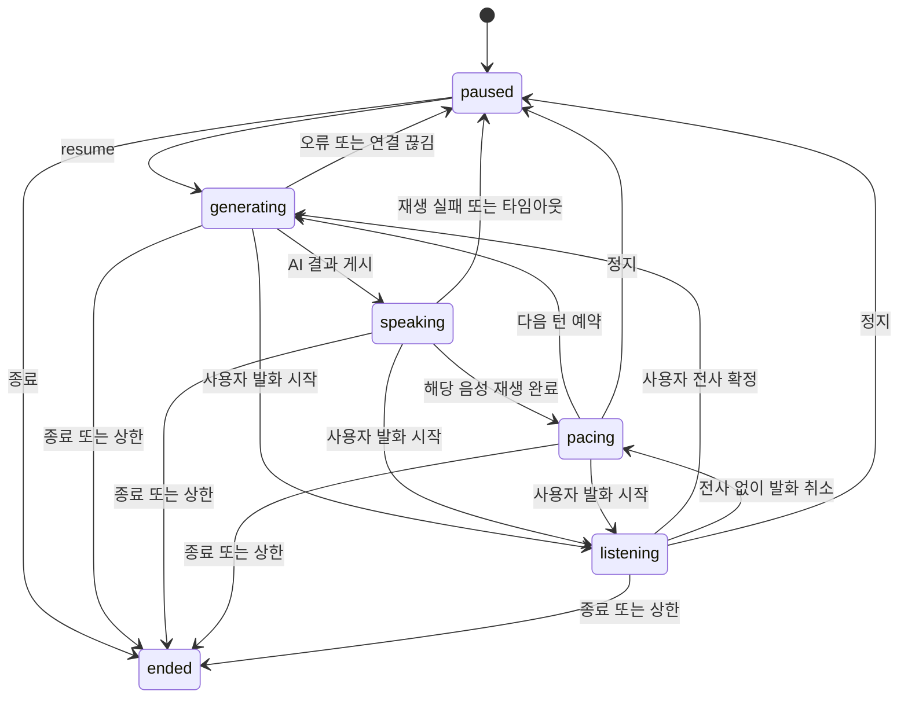

# 음성 대화 설계

버전 0.2 · 2026-10-01

## 모듈과 책임

```text
PC 음성 테스트 클라이언트 / 이후 Android 클라이언트
  마이크 · 발화 감지 · 전사 · 음성 재생 · 즉시 재생 취소
              ↕ WebSocket 제어 이벤트
Backend API
  Conversation Engine
    상태와 revision · 화자 선택 · 예약 · 취소 · 예산
         ├─ Persona와 Topic 데이터
         ├─ LLM Gateway → Demo / 실제 Provider
         └─ Session Repository → 로컬 SQLite
```

초기 서버는 FastAPI 단일 프로세스다. SQLite로 추가 DB 설치 없이 확정 기록을 저장한다. 저장소 경계를 유지해 다중 사용자 출시 단계에서 PostgreSQL로 바꿀 수 있다. PC 화면은 HTML·CSS·JavaScript로 만들고 별도 프런트엔드 빌드 도구를 요구하지 않는다.

PC 브라우저의 SpeechRecognition과 speechSynthesis는 개발 어댑터다. 지원 여부, 네트워크, 설치된 음성에 영향을 받는다. 실제 Android 음성 캡처, 에코 제거, STT/TTS 어댑터와 동일한 품질을 보장하지 않는다. Android에는 같은 대화 제어 이벤트 계약을 적용한다.

## 세션 상태



## 발언권과 취소

1. 브라우저는 사용자 발화 시작 시 서버 왕복을 기다리지 않고 현재 음성을 취소한다.
2. 서버는 revision을 증가시키고 현재 생성, 재생 대기, 다음 턴 타이머를 취소한다.
3. 생성 작업이 취소를 무시하고 응답해도 시작 revision이 다르면 결과를 버린다.
4. 중단된 AI 발화는 `interrupted`로 표시한다. 전체 발화를 사용자가 들은 것으로 취급하지 않는다.
5. 사용자 전사를 저장하면 새로운 revision에서 응답을 생성한다. A/B 둘의 응답을 동시에 생성하지 않는다.
6. 다음 AI 턴은 클라이언트의 실제 `playback_finished`를 기다린다. 서버 생성 완료를 음성 종료로 착각하지 않는다.

Gateway 동시 실행은 세션별 1개로 제한한다. 취소가 Provider 내부 처리와 과금을 되돌린다는 보장은 없다. 요청 횟수·사용량을 별도로 기록한다.

## 메시지와 이벤트 계약

메시지는 `id`, `seq`, `speaker`, `text`, `revision`, `delivery`, `created_at`을 가진다. delivery는 사용자 메시지 `received`, AI 메시지 `pending`, `played`, `interrupted` 중 하나다. 서버가 확정한 seq가 순서 기준이다.

| 클라이언트 이벤트 | 의미 |
|---|---|
| `resume` / `pause` / `end` | 세션 제어 |
| `speech_started` | 사용자 발화 시작과 재생 중단 |
| `user_message` | 확정 전사와 `client_message_id` |
| `speech_cancelled` | 음성은 감지됐지만 확정 전사 없음 |
| `playback_finished` | `message_id`, `revision`에 해당하는 음성 재생 완료 |
| `playback_failed` | 음성 출력 실패. 자동 다음 턴 금지 |
| `heartbeat` | 연결 활성 확인 |

| 서버 이벤트 | 의미 |
|---|---|
| `snapshot` | 상태와 기록 복원 |
| `state` | 현재 상태, revision, 다음 화자 |
| `message` | 사용자 또는 AI 확정 메시지 |
| `delivery` | 중단·재생 완료 상태 변경 |
| `interrupt` | 재생 취소 신호 |
| `error` | 공개 가능한 오류 코드와 안내 |

AI 재생 완료는 해당 메시지와 revision이 일치할 때만 처리한다. 재연결로 교체된 이전 소켓은 더 이상 명령을 실행할 수 없다. 마지막 연결 종료와 heartbeat 만료는 정지로 처리한다. 서버 재시작 후에도 세션은 정지로 복원한다.

## Persona와 Gateway

Persona는 id, 이름, 역할, 성격 제어값, 말투, 관심사, 관계 설정을 가진 버전 데이터다. 모델 이름은 Persona에 넣지 않는다. 주제 데이터에는 두 AI의 서로 다른 입장과 후속 관점을 넣는다.

Gateway 입력은 해당 Persona, Topic, 언어, 최근 확정 기록, 목적, 마지막 사용자 발화다. Gateway 반환은 발화 한 개와 선택적 사용량이다. 데모 Gateway는 결정적 대본을 반환하며 실제 대화 모델로 표시하지 않는다. 실제 Provider는 환경변수로 명시적으로 선택하고 키는 서버에만 둔다.

## 음성 어댑터

- SpeechRecognition의 중간 전사는 화면에만 표시하며, 최종 전사와 발화 종료 조건이 충족돼야 전송한다.
- 재생 시작·종료·오류를 서버에 알린다. 취소 시 이전 재생 콜백을 토큰으로 무효화한다.
- 웹 데모에서는 `speechstart`와 중간 전사를 끼어들기 신호로 사용한다. 선택적으로 마이크 파형 진단을 표시한다.
- 브라우저 STT가 사용하는 캡처와 별도 getUserMedia 캡처는 같다고 가정하지 않는다. 별도 마이크 미터에서 요청한 에코 제거가 STT에도 적용된다고 표시하지 않는다.
- 스피커 에코, 소음, 짧은 머뭇거림은 Android 실제 오디오 경로에서 다시 검증한다. 초기 PC 음성 검증은 이어폰 사용을 권장한다.

## 로컬 운영 범위

개발 서버는 기본 `127.0.0.1`에만 바인딩한다. 세션별 비밀 토큰으로 HTTP와 WebSocket을 보호한다. 토큰은 URL에 넣지 않고 소켓 첫 인증 이벤트로 전송한다. 공개 배포용 로그인·HTTPS·보관 정책·다중 서버 조정은 출시 단계에서 구현한다. 개발 기록은 `.runtime/`에 저장하고 Git에 넣지 않는다.

## 공식 기술 근거

- [FastAPI WebSocket](https://fastapi.tiangolo.com/advanced/websockets/)
- [MDN SpeechRecognition](https://developer.mozilla.org/en-US/docs/Web/API/SpeechRecognition): 브라우저 지원과 서버 기반 인식의 한계.
- [MDN getUserMedia](https://developer.mozilla.org/en-US/docs/Web/API/MediaDevices/getUserMedia): 권한과 localhost 보안 컨텍스트.
- [OpenAI Responses API](https://developers.openai.com/api/reference/typescript/resources/beta/subresources/responses/methods/create): 선택적 실제 LLM 어댑터 계약.

